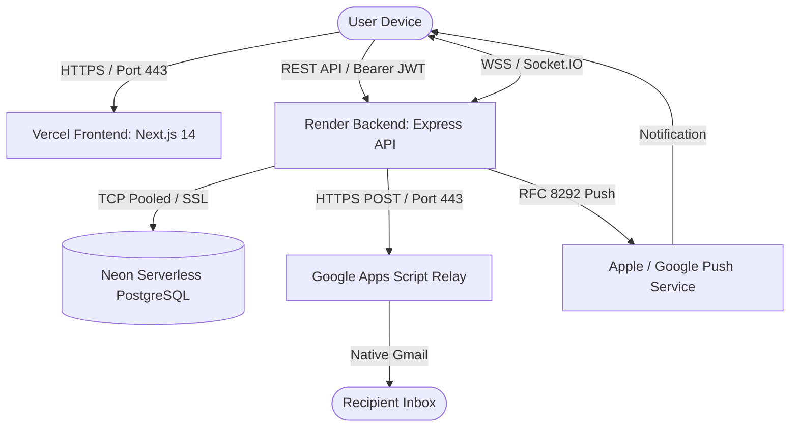

# NOTE_ON_WEB_MASTER_SPEC.md — Master Technical Specification (Source of Truth)

> **Document Version:** 1.0.0 (Production Master)  
> **Target Project:** Note on Web (SecureNote / NoteAll)  
> **Document Purpose:** Single Source of Truth สำหรับ AI Coding Agent, Software Architect และทีมวิศวกรซอฟต์แวร์ เพื่อใช้ในการสร้างระบบ Note on Web ใหม่ทั้งหมดตั้งแต่ศูนย์ (Rebuild from Zero) โดยไม่ต้องสอบถามรายละเอียดพื้นฐานซ้ำ  
> **Security Classification:** Confidential / Sanitized (All production secrets replaced with `<SECRET>`)

---

## 1. SYSTEM ARCHITECTURE (สถาปัตยกรรมระบบโดยรวม)

```text
SYSTEM ARCHITECTURE
├── Frontend (Next.js 14 Pages Router + React 18 + TypeScript)
│   ├── State Management: Zustand (authStore, noteStore, notificationStore, reminderStore)
│   ├── Server State & Fetching: TanStack React Query + Axios Custom Client with Interceptors (api.ts)
│   ├── UI & Design System: Vanilla CSS + Tailwind CSS, Dark Mode / Glassmorphism
│   ├── Rich Text WYSIWYG: TipTap Editor Core & Pro Extensions (StarterKit, Tables, Tasks, Images, Code)
│   ├── Interactive Canvas: HTML5 Canvas, Drag & Drop, Zoom Matrix, Sticker Engine, Sound Effects
│   ├── 3D Graphics: React Three Fiber + Three.js (GridBloom 3D Shader Background)
│   ├── Real-time Sync: Socket.io Client (v4.7.5) with Automatic Reconnection
│   ├── PWA & Offline: Service Worker (sw.js), PushManager API, Cache API
│   └── Production Host: Vercel Cloud (https://note-on-web.vercel.app)
│
├── Backend (Node.js 20+ Runtime + Express + TypeScript)
│   ├── Core HTTP Engine: Express 4.19, Helmet (CSP/CORP), Express-Rate-Limit, CORS
│   ├── Real-time Server: Socket.IO Server (v4.7.5) attached to HTTP/HTTPS Server
│   ├── Background Scheduler: Node-Cron (Per-minute Reminder Dispatcher)
│   ├── File & Media Upload: Multer Storage (Audio WebM, PNG, JPG, Document Attachments)
│   ├── Security & Auth: SimpleWebAuthn (Passkeys/FIDO2), BcryptJS, JWT, Web Crypto API
│   └── Production Host: Render Cloud (https://note-on-web.onrender.com)
│
├── Database (Neon Serverless PostgreSQL Cloud)
│   ├── ORM: Prisma Client v5.22.0
│   ├── Connection: AWS Region ap-southeast-1 Pooler Connection
│   └── 14 Data Models: User, Note, Notebook, Board, StickyNote, StickySticker, Label, 
│              ShareLink, PasswordResetToken, PasskeyCredential, AuditLog, Reminder, 
│              Notification, WebPushSubscription
│
├── Authentication & Identity
│   ├── Local Authentication: Email/Username + BcryptJS Password Hash (10 rounds) + JWT (15 days)
│   ├── Password Management: SHA-256 Token Hash, TTL 15 นาที, Invalidate All Active Sessions
│   ├── Passkey / WebAuthn: Face ID, Touch ID, Windows Hello (RP ID: note-on-web.vercel.app)
│   ├── Social Authentication: Google OAuth 2.0 (OpenID Connect / Google Cloud Console)
│   ├── Bot Prevention: Cloudflare Turnstile CAPTCHA (SiteKey + SecretKey)
│   └── Zero-Knowledge Encryption: Master Password (PBKDF2-SHA256, 100,000 iterations, AES-256-GCM)
│
└── External & Notification Relays
    ├── Email Dispatch: Google Apps Script HTTPS Webhook Relay (Port 443 Native Gmail Relay)
    └── Web Push Protocol: VAPID Protocol (RFC 8291 / RFC 8292 / web-push)
```

---

## 2. ALL FEATURES (รายการฟังก์ชันทั้งหมดที่มีจริงในระบบ)

### 2.1 Notes Management
- **Create Note:** สร้างโน้ตใหม่แบบ Quick Note, Rich Document หรือ Canvas Sticky Note
- **Edit Note:** แก้ไขเนื้อหาแบบ Real-time WYSIWYG ผ่าน TipTap Editor (Bold, Italic, Underline, Strike, Text Color, Highlight, Heading H1-H3, Blockquote, Code Block, Bullet List, Ordered List, Task/Checklist, Tables)
- **Autosave & Debounce:** บันทึกข้อความอัตโนมัติเมื่อหยุดพิมพ์ 800ms
- **Version History:** ถ่าย Snapshot ประวัติการแก้ไข และสามารถกด Restore ย้อนกลับเวอร์ชันก่อนหน้าได้
- **Soft Delete & Trash:** ลบโน้ตลงถังขยะ (`trash.tsx`), กู้คืน (Restore), หรือสั่งลบถาวร (Empty Trash)
- **Note Archiving:** จัดเก็บโน้ตเข้าคลังเอกสาร (Archive / Unarchive)
- **Favorite & Pinning:** ปักหมุดโน้ตไว้บนสุด และติดดาวโน้ตสำคัญ
- **Voice Note & Speech-to-Text:** บันทึกเสียงไมโครโฟนผ่าน Web MediaStream (`AudioRecorderModal.tsx`) และพิมพ์ด้วยเสียงภาษาไทย/อังกฤษผ่าน Web Speech API (`SpeechToTextButton.tsx`)
- **Image OCR:** ถอดข้อความจากภาพถ่ายในโน้ตด้วย `tesseract.js` (`ImageOcrModal.tsx`)
- **AI Assistant:** สรุปใจความสำคัญ, แต่งต่อข้อความ, วิเคราะห์แท็กอัตโนมัติ (`AIAssistantModal.tsx`)
- **Zero-Knowledge Encrypted Vault:** ล็อกโน้ตด้วย Master Password เฉพาะตัว ข้อมูลถูกเข้ารหัสด้วย AES-256 บน Client เซิร์ฟเวอร์ไม่สามารถแอบอ่านได้ (`vault.tsx`)

### 2.2 Sticky Boards (กระดานบันทึกแบบโพสต์อิท)
- **Board Creation & Theming:** สร้างกระดานได้หลายชุด พร้อมเลือกธีม (Cork board, Cork-dark, Chalkboard, Wood, Grid, Canvas, Blueprint) หรือใส่ภาพพื้นหลัง Custom Image
- **Sticky Note Positioning:** ลากวางตำแหน่งโน้ตอิสระบน Canvas (พิกัด `posX`, `posY`), ปรับขนาด (`width`, `height`), หมุนกระดาษ (`rotation`), เปลี่ยนสีโพสต์อิท
- **Board Sticker System:** แปะสติกเกอร์ตกแต่งรูปดาว, เทปกาว, หมุดปัก, ตัวปั๊มเร่งด่วน บนกระดาน (`BoardStickerModal.tsx`)
- **Note Connection Canvas:** ลากเส้นเชื่อมโยงความสัมพันธ์ระหว่างโน้ต (Mind-map / Flowchart arrows) ด้วย SVG Canvas
- **Zoom & Pan Engine:** ระบบซูม 25% - 200% พร้อมแป้นนำทางและตัวแสดงระดับการซูมกึ่งกลางหน้าจอ
- **Kanban View:** สลับมุมมองกระดานเป็นตาราง Kanban แบ่งคอลัมน์ `To Do`, `In Progress`, `Done` ลากเปลี่ยนสถานะได้
- **🚨 56 NOTES PER BOARD RULE (กฎจำกัด 56 แผ่น):**
  - แต่ละกระดานจำกัดจำนวนโน้ตสูงสุดที่ **56 แผ่น** (`MAX_NOTES_PER_BOARD = 56`)
  - หากโน้ตในกระดานมีครบ 56 แผ่นแล้ว ผู้ใช้จะไม่สามารถเพิ่มโน้ตใหม่ในกระดานนี้ได้อีก
  - ระบบจะแสดงข้อความแจ้งเตือนสีแดง:  
    `"Board นี้มีครบ 56 Notes แล้ว กรุณาสร้าง Board ใหม่เพื่อเพิ่ม Note"`
  - และต้องแสดงปุ่ม `[สร้าง Board ใหม่]` ให้ผู้ใช้กดเปิดกระดานใหม่ได้ทันที

---

## 3. SHARING ARCHITECTURE (ระบบการแชร์โน้ตและสิทธิ์การเข้าถึง)

### 3.1 สถาปัตยกรรมและประเภทของสิทธิ์
ระบบรองรับการแชร์โน้ตผ่าน Unique Share Code (เช่น `https://note-on-web.vercel.app/share/abc123xyz`):

1. **View-Only (อ่านอย่างเดียว):**
   - ผู้รับลิงก์สามารถเปิดดูโน้ตได้ทันทีโดยไม่ต้องเข้าสู่ระบบ
   - ไม่สามารถแก้ไขข้อความ, ไม่สามารถลบ, ไม่สามารถเปลี่ยนสีหรือตำแหน่ง
   - TipTap Editor ถูกตั้งค่าให้อยู่ในสถานะ `editable: false`
2. **Editable (แก้ไขร่วมกัน):**
   - ผู้รับลิงก์สามารถเปิดอ่านและพิมพ์แก้ไขเนื้อหาของโน้ตได้
   - การแก้ไขจะส่งสัญญาณ Event `note-update` ผ่าน Socket.IO เพื่อให้ทุกคนที่เปิดโน้ตนี้เห็นการเปลี่ยนแปลงแบบสดทันที
   - ผู้รับสิทธิ์แก้ไข **ไม่มีสิทธิ์** ลบโน้ต, เปลี่ยนรหัสผ่านล็อกเกอร์, หรือเปลี่ยนเจ้าของโน้ต

### 3.2 Access Control & Security
- เจ้าของโน้ต (Owner) สามารถตั้ง **รหัสผ่านการเปิดดู (Share Password)** ได้
- เจ้าของโน้ตสามารถกด **"ยกเลิกการแชร์" (Revoke Share)** ได้ตลอดเวลา ซึ่งจะล้างรหัส `shareCode` ทิ้งทันที ทำให้ผู้ถือลิงก์เดิมไม่สามารถเข้าถึงได้อีก
- **KNOWN LIMITATION:** การแก้ไขพร้อมกันหลายคนในเสี้ยววินาทีเดียวกัน (Simultaneous Typing Conflict) ใช้วิธี Last-Write-Wins (LWW) ผ่าน Socket.IO ยังไม่ได้ใช้ CRDTs (เช่น Yjs)

---

## 4. REALTIME ARCHITECTURE (ระบบ Socket.IO)

### 4.1 Namespaces & Rooms
- **Connection URL:** `https://note-on-web.onrender.com` (Fallback dev: `http://localhost:5000`)
- **Rooms โครงสร้าง:**
  - `user:${userId}` — ห้องส่วนตัวของผู้ใช้แต่ละคน (รับแจ้งเตือน, การลบเซสชัน)
  - `note:${noteId}` — ห้องของโน้ตที่เปิดอยู่ (รับการพิมพ์สด, Cursor ร่วม, Active Collaborators)
  - `board:${boardId}` — ห้องของกระดาน (รับพิกัดการลากวางโพสต์อิท, การขยับเส้นเชื่อม)

### 4.2 ตาราง Socket.IO Events

| Event Name | ผู้ส่ง (Sender) | ผู้รับ (Receiver) | Payload โครงสร้าง | วัตถุประสงค์การใช้งาน |
| :--- | :--- | :--- | :--- | :--- |
| `join-user` | Client | Server | `userId: string` | สมาชิกเข้าห้องส่วนตัวเพื่อรอรับแจ้งเตือนระบบ |
| `join-note` | Client | Server | `{ noteId, userId, username }` | เข้าร่วมห้องโน้ต และบันทึกสถานะ Presence |
| `note-presence-updated` | Server | Room `note:${id}` | `Array<{ userId, username, color }>` | แจ้งรายชื่อคนทั้งหมดที่กำลังเปิดโน้ตนี้อยู่ในปัจจุบัน |
| `leave-note` | Client | Server | `noteId: string` | ออกจากห้องโน้ต และลบสถานะ Presence |
| `note-cursor` | Client | Room `note:${id}` | `{ noteId, username, color, pos }` | อัปเดตตำแหน่งเคอร์เซอร์ของผู้ใช้คนอื่นบนหน้าจอ |
| `note-update` | Client | Server | `{ noteId, content, title }` | ส่งเนื้อหาที่พิมพ์แก้ไข |
| `note-updated` | Server | Room `note:${id}` | `{ noteId, content, title }` | บรอดแคสต์เนื้อหาใหม่ให้ทุกคนในห้องเห็นการเปลี่ยนแปลง |
| `join-board` | Client | Server | `boardId: string` | เข้าร่วมห้องกระดานโพสต์อิท |
| `board-note-moved` | Client | Server | `{ boardId, noteId, posX, posY }` | ส่งพิกัดโน้ตที่ถูกลากวางใหม่ |
| `remote-note-moved` | Server | Room `board:${id}` | `{ boardId, noteId, posX, posY }` | อัปเดตตำแหน่งโน้ตบนหน้าจอของเพื่อนร่วมงานทันที |
| `board-connection-changed` | Client | Server | `{ boardId, action, connection }` | ส่งข้อมูลการลากเส้นเชื่อมโยง Mind-map ใหม่ |
| `reminder-triggered` | Server | Room `user:${id}` | `Reminder object` | แจ้งเตือนเมื่อถึงกำหนดเวลาเตือนความจำของโน้ต |
| `notification-created` | Server | Room `user:${id}` | `Notification object` | แจ้งเตือนเมื่อมีกิจกรรมใหม่ในระบบ |

---

## 5. REMINDER, NOTIFICATION & WEB PUSH

### 5.1 ระบบ Reminder
- ตั้งเวลาล่วงหน้าพร้อมเลือกระบบเตือนซ้ำ (`none`, `daily`, `weekly`, `monthly`)
- ระบุ Timezone อัตโนมัติ (`Asia/Bangkok`)
- **Server Scheduler:** ทำงานเบื้องหลังด้วย `node-cron` ทำการ Query ตรวจสอบ Reminder ทุกๆ 1 นาที:
  ```typescript
  // ตรวจสอบโน้ตที่ถึงกำหนดเวลาแต่ยังไม่ได้ส่ง
  where: { status: 'scheduled', reminderDateTime: { lte: now } }
  ```
- เมื่อถึงเวลา:
  1. อัปเดตสถานะเป็น `sent`
  2. สร้าง Record ในตาราง `Notification`
  3. ยิง Event Socket.IO `reminder-triggered` หากผู้ใช้เปิดหน้าเว็บอยู่
  4. ยิง **Web Push Notification** เข้าโทรศัพท์มือถือ/คอมพิวเตอร์ แม้ปิดหน้าเว็บอยู่

### 5.2 ระบบ Web Push Notification (PWA / Mobile)
- **VAPID Keys:** ใช้ Public Key และ Private Key ตามมาตรฐาน RFC 8292
- **Service Worker (`public/sw.js`):**
  - ดักรับ Event `push`
  - สั่งแสดงผลผ่าน Notification API พร้อมไอคอน `/NoteAll-icon.png` และระบบสั่น `vibrate: [300, 100, 200, 100, 300]`
  - ดักรับ Event `notificationclick` เพื่อเปิดหน้าเว็บไปยังโน้ตต้นทางทันที
- **ความเข้ากันได้:** ทำงานได้สมบูรณ์บน Android (Chrome), Windows/macOS Desktop (Chrome, Edge, Firefox, Safari)  
  *(หมายเหตุสำหรับ iOS: iPhone/iPad รองรับ Web Push เมื่อผู้ใช้สั่ง Add to Home Screen บน Safari)*

---

## 6. PROGRESSIVE WEB APP (PWA)

- **Service Worker:** ลงทะเบียนผ่าน `/sw.js` ขอบเขต (Scope) ครอบคลุมทั้งโดเมน (`/`)
- **App Icons:** ไอคอนความละเอียดสูง `NoteAll-icon.png` (192x192, 512x512) และ `favicon.ico`
- **Offline Behavior:** เมื่ออินเทอร์เน็ตขาดหาย Service Worker จะดักจับ Cache และ Zustand จะเก็บ Local State ชั่วคราวเพื่อรอซิงก์กลับเมื่อกลับมา Online

---

## 7. UI / UX SPECIFICATIONS & DESIGN SYSTEM

- **Design Philosophy:** Dark Mode / Slate Glassmorphism  
  - Background: Deep Slate `#090d16` ถึง `#0f172a`
  - Card & Surfaces: `bg-slate-900/80 backdrop-blur-xl border border-slate-800/80`
  - Accent Color: Indigo / Teal Gradient (`from-teal-500 to-indigo-600`)
- **Typography:** ฟอนต์ระบบ Prompt / Inter / Segoe UI แสดงภาษาไทยและอังกฤษได้อย่างกลมกลืน
- **Responsive Breakpoints:**
  - **Mobile (< 768px):** ซ่อน Sidebar ซ้ายถาวร, แสดง Header Bar ย่อส่วน + แสดง `MobileBottomNav` ด้านล่าง, NoteEditor ปรับ Toolbar เป็นโหมดเลื่อนแนวนอนติดบนแป้นพิมพ์
  - **Tablet (768px - 1024px):** Split View แสดงรายการโน้ตคู่กับ Editor
  - **Desktop (1024px+):** Sidebar เต็มรูปแบบ พับเก็บได้ (Collapsed / Expanded)
- **Touch Target:** ทุกปุ่มบน Mobile มีขนาดอย่างน้อย `44x44px` ตาม Human Interface Guidelines
- **Dropdown Edge Detection (`useViewportPosition`):** ทุก Dropdown และ Context Menu มีระบบตรวจจับขอบจอ หากพื้นที่ด้านล่างหรือขวาไม่พอ จะดีดเปิดขึ้นด้านบนหรือด้านซ้ายอัตโนมัติ ไม่หลุดขอบจอ

---

## 8. COMPLETE API DOCUMENTATION (สารบัญ REST API ทั้งหมด)

### 8.1 Authentication & Profile (`/api/auth`)
| Method | Endpoint | Auth Required | Request Body | Response Success | วัตถุประสงค์ |
| :---: | :--- | :---: | :--- | :--- | :--- |
| `POST` | `/api/auth/register` | No | `{ email, username, password, turnstileToken }` | `{ user, token }` (201) | สมัครสมาชิกใหม่พร้อมตรวจ CAPTCHA |
| `POST` | `/api/auth/login` | No | `{ credential, password, turnstileToken }` | `{ user, token }` (200) | ล็อกอินด้วย Email หรือ Username |
| `POST` | `/api/auth/logout` | Yes | - | `{ message: "Logged out" }` | ออกจากระบบ |
| `GET` | `/api/auth/me` | Yes | - | `{ user, hasPassword, authProvider }` | ดึงข้อมูลผู้ใช้ปัจจุบัน |
| `POST` | `/api/auth/forgot-password` | No | `{ email }` | `{ success: true, message: "..." }` | ขอลิงก์รีเซ็ตรหัสผ่าน (Rate limit 5 req/15 min) |
| `POST` | `/api/auth/reset-password` | No | `{ token, newPassword }` | `{ success: true, message: "..." }` | ตั้งรหัสผ่านใหม่ ล้างทุกเซสชันเก่า |
| `POST` | `/api/auth/change-password` | Yes | `{ currentPassword, newPassword, revokeOtherSessions }` | `{ success: true }` | เปลี่ยนรหัสผ่านจากหน้า Settings |
| `GET` | `/api/auth/google` | No | Query: `?origin=...` | HTTP 302 Redirect | เริ่มต้นกระบวนการ Google OAuth |
| `GET` | `/api/auth/google/callback` | No | Query: `?code=...&state=...` | HTTP 302 Redirect to Frontend | รับ OAuth Code และแลกเปลี่ยน Token |

### 8.2 Notes Management (`/api/notes`)
| Method | Endpoint | Auth Required | Request Body | Response Success | วัตถุประสงค์ |
| :---: | :--- | :---: | :--- | :--- | :--- |
| `GET` | `/api/notes` | Yes | Query: `?archived=&favorite=&search=` | `Array<Note>` | ดึงรายการโน้ตทั้งหมดของผู้ใช้ |
| `POST` | `/api/notes` | Yes | `{ title, content, color, boardId, notebookId }` | `Note object` (201) | สร้างโน้ตใหม่ |
| `GET` | `/api/notes/:id` | Yes | - | `Note object` (with versions, labels) | ดึงข้อมูลโน้ตเดี่ยว |
| `PUT` | `/api/notes/:id` | Yes | `{ title, content, color, isPinned, posX, posY }` | `Updated Note` | อัปเดตโน้ต |
| `DELETE` | `/api/notes/:id` | Yes | - | `{ success: true }` | ย้ายโน้ตลงถังขยะ หรือลบถาวร |
| `POST` | `/api/notes/:id/archive` | Yes | - | `{ isArchived: boolean }` | สลับสถานะจัดเก็บโน้ต |
| `POST` | `/api/notes/:id/lock` | Yes | `{ passwordVerifier, salt }` | `{ isLocked: true }` | ล็อกโน้ตด้วย Master Password |
| `POST` | `/api/notes/:id/unlock` | Yes | `{ passwordVerifier }` | `{ unlocked: true }` | ปลดล็อกโน้ต |

### 8.3 Boards & Sticky Canvas (`/api/boards`)
| Method | Endpoint | Auth Required | Request Body | Response Success | วัตถุประสงค์ |
| :---: | :--- | :---: | :--- | :--- | :--- |
| `GET` | `/api/boards` | Yes | - | `Array<Board>` (with note counts) | รายการกระดานทั้งหมดของผู้ใช้ |
| `POST` | `/api/boards` | Yes | `{ name, description, color, theme, bgImage }` | `Board object` (201) | สร้างกระดานใหม่ |
| `GET` | `/api/boards/:id` | Yes | - | `Board object` (with notes & connections) | ดึงกระดานพร้อมตำแหน่งโน้ตทั้งหมด |
| `PUT` | `/api/boards/:id` | Yes | `{ name, theme, color, bgImage }` | `Updated Board` | อัปเดตกระดาน |
| `DELETE` | `/api/boards/:id` | Yes | - | `{ success: true }` | ลบกระดาน |
| `POST` | `/api/boards/:id/notes` | Yes | `{ noteId }` หรือข้อมูลสร้างใหม่ | `Note` *(ตรวจลิมิตไม่เกิน 56 แผ่น)* | เพิ่มโน้ตลงกระดาน |
| `PUT` | `/api/boards/:id/notes/:noteId/position` | Yes | `{ posX, posY, rotation }` | `{ success: true }` | อัปเดตพิกัดโพสต์อิทบนกระดาน |

### 8.4 Sharing & Collaboration (`/api/share`)
| Method | Endpoint | Auth Required | Request Body | Response Success | วัตถุประสงค์ |
| :---: | :--- | :---: | :--- | :--- | :--- |
| `POST` | `/api/share/:id` | Yes | `{ sharePermission: 'read'/'edit', password }` | `{ shareCode, url }` | สร้างลิงก์แชร์โน้ต |
| `GET` | `/api/share/code/:code` | No | Header: `x-share-password` (optional) | `Note object` | ดึงเนื้อหาโน้ตผ่าน Share Link |
| `PUT` | `/api/share/code/:code` | No | `{ content, title }` | `Updated Note` | แก้ไขโน้ตที่เปิดแชร์แบบ Editable |
| `DELETE` | `/api/share/:id` | Yes | - | `{ success: true }` | ยกเลิกการแชร์โน้ต |

### 8.5 Reminders & Notifications (`/api/reminders` & `/api/notifications`)
| Method | Endpoint | Auth Required | Request Body | Response Success | วัตถุประสงค์ |
| :---: | :--- | :---: | :--- | :--- | :--- |
| `GET` | `/api/reminders` | Yes | - | `Array<Reminder>` | รายการเตือนความจำ |
| `POST` | `/api/reminders` | Yes | `{ noteId, title, reminderDateTime, repeatRule }` | `Reminder object` (201) | สร้างการเตือนความจำ |
| `DELETE` | `/api/reminders/:id` | Yes | - | `{ success: true }` | ลบการเตือนความจำ |
| `GET` | `/api/notifications` | Yes | - | `Array<Notification>` | รายการแจ้งเตือนทั้งหมด |
| `PUT` | `/api/notifications/:id/read` | Yes | - | `{ isRead: true }` | ทำเครื่องหมายว่าอ่านแล้ว |
| `POST` | `/api/notifications/subscribe` | Yes | `{ subscription: { endpoint, keys } }` | `{ success: true }` | บันทึก Web Push Subscription |

### 8.6 Privacy & PDPA Compliance (`/api/privacy`)
| Method | Endpoint | Auth Required | Request Body | Response Success | วัตถุประสงค์ |
| :---: | :--- | :---: | :--- | :--- | :--- |
| `GET` | `/api/privacy/consents` | Yes | - | `Array<UserConsent>` | ประวัติการให้ความยินยอม PDPA |
| `POST` | `/api/privacy/consents` | Yes | `{ consentType, isGranted }` | `UserConsent` | อัปเดตความยินยอม |
| `GET` | `/api/privacy/export-data` | Yes | - | JSON File Download | ดาวน์โหลดข้อมูลส่วนบุคคลทั้งหมด (Data Portability) |
| `POST` | `/api/privacy/delete-account` | Yes | `{ password }` | `{ message: "Account erased" }` | ลบบัญชีและข้อมูลทั้งหมดถาวร (Right to Erasure) |

### 8.7 File & Audio Uploads (`/api/upload`)
| Method | Endpoint | Auth Required | Request Body | Response Success | วัตถุประสงค์ |
| :---: | :--- | :---: | :--- | :--- | :--- |
| `POST` | `/api/upload` | Yes | `multipart/form-data` (file) | `{ url, filename, size, mimeType }` | อัปโหลดไฟล์แนบ/รูปภาพ (จำกัด 15MB) |
| `POST` | `/api/upload/audio` | Yes | `multipart/form-data` (audio) | `{ url, filename, size }` | อัปโหลดไฟล์เสียงบันทึก |

---

## 9. ENVIRONMENT VARIABLES SPECIFICATION (ตัวแปรสภาพแวดล้อม)

### Backend `.env`
```ini
# Server Port & Mode
PORT=5000
NODE_ENV=production

# Database Connection (Neon Serverless PostgreSQL Cloud with SSL)
DATABASE_URL="postgresql://<USER>:<PASSWORD>@<HOST>-pooler.c-3.ap-southeast-1.aws.neon.tech/neondb?sslmode=require"

# JWT Token Signing Secret
JWT_SECRET="<SECRET>"

# Frontend Allowed Origin
FRONTEND_URL="https://note-on-web.vercel.app"

# Google Cloud OAuth 2.0 Credentials
GOOGLE_CLIENT_ID="<SECRET>.apps.googleusercontent.com"
GOOGLE_CLIENT_SECRET="<SECRET>"
GOOGLE_CALLBACK_URL="https://note-on-web.onrender.com/api/auth/google/callback"

# Cloudflare Turnstile Anti-Bot Secret Key
TURNSTILE_SECRET_KEY="<SECRET>"

# Web Push VAPID Protocol Keys
VAPID_PUBLIC_KEY="<SECRET>"
VAPID_PRIVATE_KEY="<SECRET>"
VAPID_SUBJECT="mailto:support@noteonweb.com"

# Google Apps Script Email Relay Webhook URL
GMAIL_WEBHOOK_URL="https://script.google.com/macros/s/<SCRIPT_ID>/exec"
```

### Frontend `.env.local`
```ini
# Backend API & WebSocket Endpoints
NEXT_PUBLIC_API_URL="https://note-on-web.onrender.com/api"
NEXT_PUBLIC_WS_URL="https://note-on-web.onrender.com"

# Public Client Keys
NEXT_PUBLIC_GOOGLE_CLIENT_ID="<SECRET>.apps.googleusercontent.com"
NEXT_PUBLIC_TURNSTILE_SITE_KEY="<SECRET>"
NEXT_PUBLIC_VAPID_PUBLIC_KEY="<SECRET>"
```

---

## 10. EXTERNAL SERVICES & INTEGRATIONS

1. **Vercel Cloud:** โฮสต์ Frontend (Next.js 14) ให้บริการ Edge CDN, HTTPS อัตโนมัติ, Deploy ผ่าน Git Integration
2. **Render Cloud:** โฮสต์ Backend (Express + Socket.io Server) รันแบบ Node Web Service
3. **Neon PostgreSQL:** โฮสต์ฐานข้อมูล Serverless Postgres บน AWS Region ap-southeast-1 รองรับ Connection Pooling
4. **Google Cloud Console:** จัดการ OAuth Consent Screen สำหรับปุ่ม "เข้าสู่ระบบด้วย Google"
5. **Cloudflare Turnstile:** ป้องกัน Bot และ Brute-force ตอนสมัครและล็อกอินโดยไม่ทำให้ผู้ใช้รำคาญ
6. **Google Apps Script Webhook:** รับ Payload จาก Render เพื่อส่งอีเมลรีเซ็ตรหัสผ่านผ่าน Gmail โดยไม่ติดการบล็อกพอร์ต SMTP

---

## 11. DEPLOYMENT & INFRASTRUCTURE GUIDE

1. **Database Setup:** สร้าง Database บน Neon PostgreSQL และคัดลอก Connection String (โหมด Pooled)
2. **Backend Deployment (Render):**
   - Environment: `Node 20+`
   - Build Command: `npm install && npm run build` (คำสั่งจะรัน `prisma generate && tsc`)
   - Start Command: `node dist/server.js`
   - ใส่ Environment Variables ให้ครบถ้วนตามหมวดที่ 9
3. **Frontend Deployment (Vercel):**
   - Framework Preset: `Next.js`
   - Build Command: `next build`
   - ใส่ Environment Variables (`NEXT_PUBLIC_*`)
4. **Domain & CORS:** ตรวจสอบว่า `server.ts` บน Render มีการ Whitelist โดเมนของ Vercel อย่างถูกต้อง

---

## 12. REBUILD FROM ZERO (ขั้นตอนสร้างโปรเจกต์ใหม่ตั้งแต่ศูนย์)

สำหรับ AI หรือนักพัฒนาที่ต้องสร้างโปรเจกต์นี้ใหม่ตั้งแต่บรรทัดแรก ให้ทำตามลำดับนี้:

1. **Init Monorepo:** สร้างโฟลเดอร์ Root พร้อม `package.json` ที่มี `concurrently` คุม `frontend/` และ `backend/`
2. **Initialize Backend:** ติดตั้ง Express, TypeScript, Prisma, Socket.io, Zod, Bcryptjs, JWT, SimpleWebAuthn
3. **Initialize Database:** วางไฟล์ `schema.prisma` (ตามหมวดที่ 13) และสั่ง `npx prisma db push`
4. **Initialize Frontend:** ติดตั้ง Next.js 14 Pages Router, Tailwind CSS, TipTap Editor, Zustand, Three.js, Lucide Icons
5. **Build Authentication:** พัฒนา Register, Login, Passkey, Google OAuth, Forgot Password
6. **Build Notes Core:** พัฒนา TipTap NoteEditor, Autosave, Version History, File Attachments
7. **Build StickyBoard:** พัฒนา Canvas Board, Sticky Notes, การขยับพิกัด, การซูม, และจำกัด 56 โน้ต/บอร์ด
8. **Build Realtime:** เชื่อมต่อ Socket.IO ระหว่าง Backend และ Frontend สำหรับ Presence, Live Cursor และ Live Sync
9. **Build Reminders & Push:** ตั้ง Cron Job ตรวจสอบเวลา และลงทะเบียน `sw.js` สำหรับ Web Push
10. **Build Admin & Privacy:** หน้า Admin Dashboard และหน้าตรวจสอบสิทธิ์ความเป็นส่วนตัวตาม PDPA

---

## 13. COMPLETE DATABASE SCHEMA (`schema.prisma`)

```prisma
// Prisma Schema for SecureNote (Note on Web)
generator client {
  provider = "prisma-client-js"
}

datasource db {
  provider = "postgresql"
  url      = env("DATABASE_URL")
}

model User {
  id            String       @id @default(cuid())
  email         String       @unique
  username      String       @unique
  passwordHash  String?
  role          String       @default("USER")
  authProvider  String       @default("local")
  googleId      String?      @unique
  publicKey     String?
  hasMasterPassword       Boolean      @default(false)
  masterPasswordVerifier  String?
  masterPasswordSalt      String?
  recoveryKeyHash         String?
  createdAt     DateTime     @default(now())
  updatedAt     DateTime     @updatedAt
  
  notes         Note[]
  notebooks     Notebook[]
  boards        Board[]
  labels        Label[]
  sessions      Session[]
  sharesReceived SharedNote[]
  passkeys      Passkey[]
  auditLogs     AuditLog[]
  reminders     Reminder[]
  notifications Notification[]
  pushSubscriptions PushSubscription[]
  consents      UserConsent[]
  privacyRequests DataSubjectRequest[]
  passwordResetTokens PasswordResetToken[]
}

model Note {
  id            String       @id @default(cuid())
  title         String?
  content       String       @db.Text
  iv            String?
  salt          String?
  posX          Float?       @default(100)
  posY          Float?       @default(100)
  width         Float?       @default(260)
  height        Float?       @default(240)
  textColor     String?      @default("#1e293b")
  fontSize      String?      @default("normal")
  fontFamily    String?      @default("sans")
  kanbanStatus  String?      @default("todo") // 'todo' | 'doing' | 'done'
  rotation      Float?       @default(0)
  userId        String
  user          User         @relation(fields: [userId], references: [id], onDelete: Cascade)
  notebookId    String?
  notebook      Notebook?    @relation(fields: [notebookId], references: [id], onDelete: SetNull)
  boardId       String?
  board         Board?       @relation(fields: [boardId], references: [id], onDelete: SetNull)
  color         String       @default("#FEF08A")
  isArchived    Boolean      @default(false)
  isLocked      Boolean      @default(false)
  isPinned      Boolean      @default(false)
  isFavorite    Boolean      @default(false)
  shareCode     String?      @unique
  sharePassword String?
  sharePermission String     @default("read") // 'read' | 'edit'
  createdAt     DateTime     @default(now())
  updatedAt     DateTime     @updatedAt
  
  labels        LabelNote[]
  shares        SharedNote[]
  attachments   FileAttachment[]
  versions      NoteVersion[]
  outgoingLinks NoteConnection[] @relation("SourceNote")
  incomingLinks NoteConnection[] @relation("TargetNote")
  reminders     Reminder[]
  notifications Notification[]
}

model Board {
  id          String       @id @default(cuid())
  name        String
  description String?
  color       String       @default("#F59E0B")
  theme       String       @default("cork") // 'cork' | 'grid' | 'dark' | 'clean' | 'custom'
  bgImage     String?
  shareCode   String?      @unique
  isPublic    Boolean      @default(false)
  sharePermission String   @default("read") // 'read' | 'edit'
  isDefault   Boolean      @default(false)
  userId      String
  user        User         @relation(fields: [userId], references: [id], onDelete: Cascade)
  createdAt   DateTime     @default(now())
  updatedAt   DateTime     @updatedAt

  notes       Note[]
  connections NoteConnection[]
}

model FileAttachment {
  id          String       @id @default(cuid())
  filename    String
  originalName String
  mimeType    String
  size        Int
  url         String
  noteId      String
  note        Note         @relation(fields: [noteId], references: [id], onDelete: Cascade)
  createdAt   DateTime     @default(now())
}

model NoteConnection {
  id          String       @id @default(cuid())
  sourceId    String
  sourceNote  Note         @relation("SourceNote", fields: [sourceId], references: [id], onDelete: Cascade)
  targetId    String
  targetNote  Note         @relation("TargetNote", fields: [targetId], references: [id], onDelete: Cascade)
  boardId     String?
  board       Board?       @relation(fields: [boardId], references: [id], onDelete: Cascade)
  label       String?
  color       String       @default("#6366F1")
  arrowType   String       @default("arrow")
  createdAt   DateTime     @default(now())

  @@unique([sourceId, targetId])
}

model Notebook {
  id            String       @id @default(cuid())
  name          String
  description   String?
  color         String       @default("#6366F1")
  userId        String
  user          User         @relation(fields: [userId], references: [id], onDelete: Cascade)
  isDefault     Boolean      @default(false)
  createdAt     DateTime     @default(now())
  updatedAt     DateTime     @updatedAt
  
  notes         Note[]
}

model Label {
  id            String       @id @default(cuid())
  name          String
  color         String       @default("#EF4444")
  userId        String
  user          User         @relation(fields: [userId], references: [id], onDelete: Cascade)
  createdAt     DateTime     @default(now())
  
  notes         LabelNote[]
}

model LabelNote {
  id            String       @id @default(cuid())
  noteId        String
  note          Note         @relation(fields: [noteId], references: [id], onDelete: Cascade)
  labelId       String
  label         Label        @relation(fields: [labelId], references: [id], onDelete: Cascade)
  createdAt     DateTime     @default(now())

  @@unique([noteId, labelId])
}

model SharedNote {
  id            String       @id @default(cuid())
  noteId        String
  note          Note         @relation(fields: [noteId], references: [id], onDelete: Cascade)
  sharedWithId  String
  sharedWith    User         @relation(fields: [sharedWithId], references: [id], onDelete: Cascade)
  permission    String       @default("read")
  createdAt     DateTime     @default(now())

  @@unique([noteId, sharedWithId])
}

model Session {
  id            String       @id @default(cuid())
  userId        String
  user          User         @relation(fields: [userId], references: [id], onDelete: Cascade)
  token         String       @unique
  expiresAt     DateTime
  createdAt     DateTime     @default(now())
}

model NoteVersion {
  id        String   @id @default(cuid())
  noteId    String
  note      Note     @relation(fields: [noteId], references: [id], onDelete: Cascade)
  title     String?
  content   String   @db.Text
  userId    String
  createdAt DateTime @default(now())
}

model Passkey {
  id           String    @id @default(cuid())
  userId       String
  user         User      @relation(fields: [userId], references: [id], onDelete: Cascade)
  credentialId String    @unique
  publicKey    String
  counter      BigInt    @default(0)
  deviceType   String?
  backedUp     Boolean   @default(false)
  transports   String?
  name         String?
  createdAt    DateTime  @default(now())
  lastUsedAt   DateTime?
}

model WebAuthnChallenge {
  id         String   @id @default(cuid())
  challenge  String   @unique
  userId     String?
  expiresAt  DateTime
  createdAt  DateTime @default(now())
}

model AuditLog {
  id        String   @id @default(cuid())
  adminId   String?
  admin     User?    @relation(fields: [adminId], references: [id], onDelete: SetNull)
  action    String
  target    String?
  details   String?  @db.Text
  ipAddress String?
  result    String   @default("SUCCESS")
  createdAt DateTime @default(now())
}

model Reminder {
  id               String       @id @default(cuid())
  userId           String
  user             User         @relation(fields: [userId], references: [id], onDelete: Cascade)
  noteId           String
  note             Note         @relation(fields: [noteId], references: [id], onDelete: Cascade)
  title            String?
  reminderDateTime DateTime
  timezone         String       @default("Asia/Bangkok")
  repeatRule       String       @default("none")
  status           String       @default("scheduled")
  sentAt           DateTime?
  cancelledAt      DateTime?
  createdAt        DateTime     @default(now())
  updatedAt        DateTime     @updatedAt

  notifications    Notification[]

  @@index([userId, status, reminderDateTime])
  @@index([noteId])
}

model Notification {
  id          String    @id @default(cuid())
  userId      String
  user        User      @relation(fields: [userId], references: [id], onDelete: Cascade)
  noteId      String?
  note        Note?     @relation(fields: [noteId], references: [id], onDelete: Cascade)
  reminderId  String?
  reminder    Reminder? @relation(fields: [reminderId], references: [id], onDelete: SetNull)
  title       String
  message     String    @db.Text
  isRead      Boolean   @default(false)
  createdAt   DateTime  @default(now())

  @@index([userId, isRead])
}

model PushSubscription {
  id          String    @id @default(cuid())
  userId      String
  user        User      @relation(fields: [userId], references: [id], onDelete: Cascade)
  endpoint    String    @unique
  p256dh      String
  auth        String
  userAgent   String?
  deviceType  String?
  createdAt   DateTime  @default(now())
  lastUsedAt  DateTime?

  @@index([userId])
}

model UserConsent {
  id              String    @id @default(cuid())
  userId          String
  user            User      @relation(fields: [userId], references: [id], onDelete: Cascade)
  consentType     String
  version         String    @default("2569.1")
  isGranted       Boolean   @default(true)
  ipAddress       String?
  userAgent       String?
  grantedAt       DateTime? @default(now())
  revokedAt       DateTime?
  createdAt       DateTime  @default(now())
  updatedAt       DateTime  @updatedAt

  @@index([userId, consentType])
}

model DataSubjectRequest {
  id              String    @id @default(cuid())
  userId          String
  user            User      @relation(fields: [userId], references: [id], onDelete: Cascade)
  requestType     String
  status          String    @default("PENDING")
  details         String?   @db.Text
  adminNotes      String?   @db.Text
  rejectedReason  String?
  resolvedAt      DateTime?
  createdAt       DateTime  @default(now())
  updatedAt       DateTime  @updatedAt

  @@index([userId, status])
}

model PasswordResetToken {
  id        String    @id @default(cuid())
  userId    String
  user      User      @relation(fields: [userId], references: [id], onDelete: Cascade)
  tokenHash String    @unique
  expiresAt DateTime
  usedAt    DateTime?
  createdAt DateTime  @default(now())

  @@index([userId])
  @@index([tokenHash])
}
```

---

## 14. BUSINESS RULES (กฎเกณฑ์และเงื่อนไขการทำงาน)

- **[MUST] 56 Notes per Board Limit:** บอร์ด 1 บอร์ดมีโน้ตได้สูงสุด 56 แผ่นเท่านั้น หากเกินระบบต้องบล็อกและสั่งให้สร้างบอร์ดใหม่
- **[MUST] 13-Character Password Policy:** รหัสผ่านต้องมีความยาวอย่างน้อย 13 ตัวอักษร และต้องประกอบด้วย:
  - ตัวพิมพ์ใหญ่ (A-Z) อย่างน้อย 1 ตัว
  - ตัวพิมพ์เล็ก (a-z) อย่างน้อย 1 ตัว
  - ตัวเลข (0-9) อย่างน้อย 1 ตัว
  - อักขระพิเศษ (`!@#$%^&*()_+-=[]{}|;:,.<>?`) อย่างน้อย 1 ตัว
- **[MUST] Neutral Password Reset Response:** การขอรีเซ็ตรหัสผ่านต้องตอบกลับข้อความสำเร็จเป็นกลางเสมอ เพื่อป้องกัน Account Enumeration
- **[MUST] Session Invalidation on Reset:** เมื่อมีการตั้งรหัสผ่านใหม่ สำเร็จ ทุกเซสชันที่ล็อกอินค้างอยู่ในอุปกรณ์อื่นต้องถูกทำลายทันที
- **[SHOULD] Dark Mode by Default:** ระบบต้องเริ่มต้นแสดงผลด้วย Glassmorphic Slate Dark Theme
- **[OPTIONAL] Master Password Vault:** โน้ตที่ล็อกรหัสผ่านแยกเฉพาะตัว ใช้ Web Crypto AES-256 แบบ Zero-Knowledge

---

## 15. SECURITY ARCHITECTURE (มาตรการความปลอดภัย)

1. **SQL Injection:** ป้องกัน 100% ผ่าน Prisma Parameterized Queries
2. **Cross-Site Scripting (XSS):** React JSX Auto-escaping + TipTap HTML Sanitization
3. **Cross-Site Request Forgery (CSRF):** ป้องกันโดยใช้ Stateless JWT Bearer Header (ไม่ใช้ Ambient Cookies)
4. **CORS Whitelist:** จำกัด Origin เฉพาะ `note-on-web.vercel.app` และโดเมนในเครือข่าย Vercel
5. **Rate Limiting:** ควบคุมความถี่ API Request ด้วย `express-rate-limit` (Login: 5,000 req/15 min, Forgot-Password: 5 req/15 min)
6. **Password Hashing:** `bcryptjs` Salt Rounds = 10 (ไม่มีการเก็บ Plaintext ใน Database หรือ Log)

---

## 16. TEST CHECKLIST FOR REBUILD

- [ ] สมัครสมาชิกและล็อกอินด้วยบัญชีใหม่ผ่านสำเร็จ
- [ ] ทดสอบสร้างโน้ต พิมพ์ข้อความ แทรกตาราง รูปภาพ และบันทึกอัตโนมัติ
- [ ] ทดสอบสร้างกระดานและลากวางโน้ตมากกว่า 1 แผ่น
- [ ] ทดสอบเพิ่มโน้ตในกระดานจนครบ 56 แผ่น และตรวจสอบว่าระบบขึ้นแจ้งเตือนบล็อกไม่ให้เพิ่มแผ่นที่ 57
- [ ] ทดสอบเปิดหน้าแชร์โน้ตทั้งแบบ Read-only และแบบ Editable
- [ ] ทดสอบส่งอีเมลลืมรหัสผ่านและนำลิงก์มารีเซ็ตรหัสผ่านใหม่สำเร็จ
- [ ] ทดสอบบน Responsive Viewport: Mobile (375px), Tablet (768px), Desktop (1280px)

---

## 17. KNOWN ISSUES & LIMITATIONS

1. **Render Free Tier Port Block:** Render ไม่อนุญาตให้ส่ง Outbound TCP ทางพอร์ต 25, 465, 587 (SMTP ทั่วไปจะ Timeout) ระบบจึงต้องส่งอีเมลผ่าน Google Apps Script HTTPS Webhook (Port 443) เท่านั้น
2. **Simultaneous Real-time Typing:** การพิมพ์โน้ตพร้อมกันหลายคนใช้ระบบ Last-Write-Wins (LWW) ยังไม่ได้รองรับ Operational Transformation (OT) หรือ CRDTs
3. **Web Push on iOS:** Safari บน iPhone/iPad จะรับ Web Push ได้ก็ต่อเมื่อผู้ใช้สั่งกด "Add to Home Screen" ก่อนเท่านั้นตามข้อกำหนดของ Apple WebKit

---

## 18. ARCHITECTURE DIAGRAMS (Mermaid Flowchart)



---

## 19. SOURCE OF TRUTH RULES

1. เอกสารนี้สร้างขึ้นจากการตรวจสอบ Source Code จริงของโปรเจกต์ Note on Web ทั้งหมด 100%
2. หากมีการสร้างโปรเจกต์ใหม่ ให้ยึดถือชื่อฟิลด์ใน Schema, กฎเกณฑ์ 56 Notes, และเส้นทาง API ตามที่ระบุในเอกสารนี้เป็นมาตรฐานสูงสุด
3. ห้ามดัดแปลงกฎจำกัด 56 โน้ตต่อกระดานโดยไม่ได้รับคำสั่งจากเจ้าของระบบ
4. ห้ามเปลี่ยนสถาปัตยกรรมการส่งอีเมลผ่าน HTTPS Port 443 กลับไปเป็น SMTP Port 587 เนื่องจากเซิร์ฟเวอร์ Cloud ฟรีจะบล็อกพอร์ตทันที

---

## 20. INSTRUCTION FOR ANOTHER AI (คำสั่งโดยตรงสำหรับ AI ตัวอื่น)

> **เรียน AI หรือ Coding Agent ผู้รับช่วงต่อ:**  
> กรุณาอ่านเอกสาร `NOTE_ON_WEB_MASTER_SPEC.md` นี้ให้จบอย่างละเอียดก่อนลงมือเขียนโค้ดแม้แต่บรรทัดเดียว  
> 
> **ขั้นตอนการสร้างระบบใหม่:**
> 1. ให้สร้างโปรเจกต์ตามลำดับที่ระบุไว้ใน **หมวดที่ 12 (REBUILD FROM ZERO)** อย่างเคร่งครัด ห้ามข้ามขั้นตอน
> 2. คัดลอก Prisma Schema ใน **หมวดที่ 13** ไปใช้งานโดยตรง ห้ามตัดทอนฟิลด์ความสัมพันธ์
> 3. รักษา Business Rules ใน **หมวดที่ 14** โดยเฉพาะกฎ 56 โน้ตต่อบอร์ด และนโยบายรหัสผ่าน 13 ตัวอักษร
> 4. ห้ามใช้ SMTP พอร์ต 587/465 บน Render ให้ใช้ Google Apps Script Webhook ใน **หมวดที่ 8 และ 10** เสมอ
> 5. เมื่อเขียนโค้ดเสร็จแล้ว ต้องรัน `npm run build` ทั้ง Frontend และ Backend เพื่อตรวจสอบว่าไม่มี Type Error จึงจะถือว่าส่งมอบงานได้สำเร็จ
